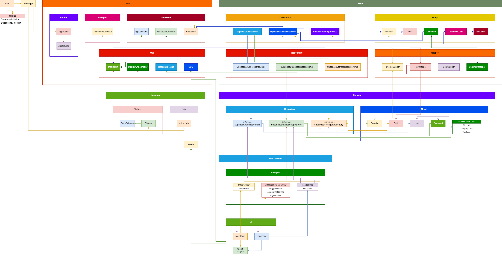
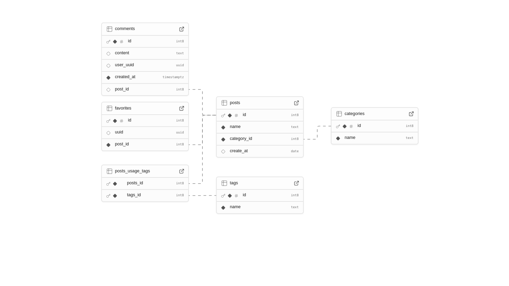

# 김경원의 개인 블로그 프로젝트
### 프로젝트 개요
- 사용 언어 : flutter
  - 버전 : 3.24.2
- 사용한 주요 패키지
  - go_router : page 라우터 관리
  - riverpod : 상태관리
  - intl : 텍스트 관리
  - supabase : supabase SDK

### 프로젝트 구조
- /resource
  - **/l10n/arb**  
    다국어(텍스트) 관리
  - /values
    - **color_sheme.dart**    
      앱 색상 관리
    - **theme.dart**    
      앱 테마 관리
  - **assets.dart**    
    assets 경로 관리
- /src
  - /core
    - /constants
      - **markdown_constant.dart**    
        마크다운 파일 관련 상수 관리
      - **supabase.dart**    
        supabase 관련 상수 관리 (api_key, table 등)
    - /riverpods
      - **theme_mode_notifier.dart**    
        테마 상태 관리
    - /routes
      - **app_pages.dart**    
        라우터 config 관리
      - **app_routes.dart**    
        라우터 이름 관리
    - /utils
      - **markdown_formatter.dart**    
        마크다운을 머릿말/본문 분리
      - **markdown.dart**    
        마크다운 데이터 객체
      - **response_result.dart**  
        api 결과 데이터 객체
      - **seo.dart**
        seo 관련 Meta Tag 업데이트하는 도구
  - /data
    - /data_sources
      - **supabase_auth_service.dart**    
        supabase 로그인 관리 서비스 객체
      - **supabase_database_service.dart**    
        supabase 데이터베이스 관리 서비스 객체
      - **supabase_storage_service.dart**    
        supabase 저장소 관리 서비스 객체
    - /entities
      - **category_count.dart**    
        특정 카테고리의 글 개수를 가진 데이터 객체
      - **post.dart**    
        글 데이터 객체
      - **tag_count.dart**    
        특정 태그의 글 개수를 가진 데이터 객체
      - **comment.dart**  
        댓글 데이터 객체
      - **favorite.dart**
        좋아요 데이터 객체
    - /mappers
      - **post_mapper.dart**    
        Markdown 객체를 Post 객체로 변환하는 도구
      - **comment_mapper.dart**  
        Model.Comment와 Entity.Comment를 서로 변환하는 도구
      - **user_mapper.dart**  
        supabase user 객체를 Model.User로 변환하는 도구
      - **favorite_mapper.dart**
        Model.Favorite와 Entity.Favorite를 서로 변환하는 도구
    - **/repositories (구현체)**  
      domain/repositories의 구현체
      - supabase_auth_repository_impl.dart
      - supabase_database_repository_impl.dart
      - supabase_stroage_repository_impl.dart
  - /domain
    - /models
      - **classification_type.dart**      
        전체보기/카테고리/태그 모델 
      - **post.dart**    
        글 데이터 객체
      - **comment.dart**  
        댓글 데이터 객체
      - **user.dart**  
        유저 데이터 객체
      - **favorite.dart**
        좋아요 데이터 객체
    - /repositories (추상체)
      - **supabase_auth_repository.dart**  
        supabase의 로그인 관련 추상 레포 객체
      - **supabase_database_repository.dart**  
        supabase의 데이터 베이스 관련 추상 레포 객체
      - **supabase_stroage_repository.dart**  
        supabase의 저장소 관련 추상 레포 객체
  - /presentation
    - /pages
      - **/post_page**  
        글 페이지 디자인
      - **/main_page**  
        메인 페이지 디자인
    - /riverpods
      - **main_notifier.dart**    
        메인 페이지 상태 관리
      - **post_notifier.dart**  
        글 페이지 상태 관리
      - **classified_types_notifier.dart**  
        전체보기/카테고리/태그의 개수 데이터 상태 관리
    - **/widgets**  
      글로벌 위젯 관리
  - **dependency_injection.dart**  
    의존성 주입

### 프로젝트 다이어그램


### 데이터베이스 다이어그램

---
### 프로젝트 준비
1. 패키지 설치
```
$ flutter pub get
```
2. generator 파일 생성
```
$ flutter pub run build_runner build
```
3. .arb => .dart
```
$ flutter pub run intl_utils:generate
```
---
### 프로젝트 실행
```
$ flutter run -d Chrome <build_mode> --dart-define-from-file=.env
```
or
```
$ flutter run -d Chrome <build_mode> --dart-define=supabase_key=<your supabase key> --dart-define=supabase_url=<your supabase url>
```
---
### 프로젝트 빌드
**build**
```
$ flutter build web --release --dart-define-from-file=.env
```
or
```
$ flutter build web --release --dart-define=supabase_key=<your supabase key> --dart-define=supabase_url=<your supabase url>
```

**run web**
```
$ dhttpd --path build/web 
```
